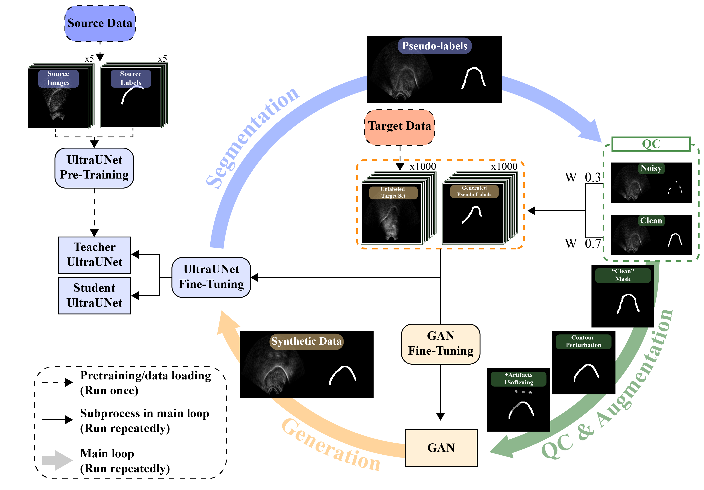

# Dual Co-Training for Ultrasound Tongue Segmentation

Segmentation-guided dual co-training pipeline involving synthetic image generation via conditional GAN and iterative segmentation refinement.

## Overview



The pipeline:
1. **GAN Pretrain** — trains a conditional GAN (Pix2Pix-style) to generate realistic ultrasound images from pseudo-masks produced by a pretrained segmenter.
2. **Dual Co-Training** — iteratively refines the segmenter using:
   - Supervised losses on clean pseudo-labels and synthetic images.
   - Mean Teacher consistency on noisy pseudo-labels.
   - Periodic GAN fine-tuning with the latest pseudo masks.

## Installation

```bash
pip install -r requirements.txt
```

## Usage

### Step 1: Pretrain segmenter (optional)

If you don't have a pretrained checkpoint, train one on a labeled dataset:

```bash
python pretrain_segmenter.py \
    --data_root ./data/dataset \
    --out_dir ./checkpoints/pretrained
```

`--data_root` is a single labeled dataset folder with `images/` (PNG) and `contours/` (JSON). The checkpoint is saved as `<out_dir>/<folder_name>.pth`.

### Step 2: Dual co-training

```bash
python train.py \
    --images_dir ./data/unlabeled/images \
    --seg_checkpoint ./checkpoints/pretrained/mydataset.pth \
    --pretrain_gan \
    --gan_checkpoint_dir ./checkpoints/gan \
    --work_dir ./runs/experiment \
    --val_dataset ./data/test \
    --seg_epochs 20 \
    --synthetic_per_epoch 1000
```

Key arguments:
| Flag | Description |
|---|---|
| `--images_dir` | Directory of **unlabeled** target-domain PNG images |
| `--seg_checkpoint` | Pretrained segmenter checkpoint (UltraUNet .pth) |
| `--pretrain_gan` | Pretrain GAN from scratch before co-training |
| `--gan_checkpoint` | Pre-existing GAN checkpoint (alternative to `--pretrain_gan`) |
| `--val_dataset` | Labeled test dataset for periodic validation (images/ + contours/) |
| `--seg_epochs` | Number of co-training epochs (default: 20) |
| `--synthetic_per_epoch` | Number of synthetic images per epoch (default: 1000) |
| `--qc_mode` | Clean/noisy split strategy: `qc` (quality check) or `heuristic` (LCC ratio) |

### Step 3: Evaluate

```bash
python eval.py \
    --checkpoint ./runs/experiment/ultraunet_student_latest.pth \
    --dataset ./data/test
```

Reports Dice (binary), Dice (soft), and MSD.

## Data format

### Labeled data (for pretraining and evaluation)
```
dataset/
├── images/
│   ├── sample_001.png
│   ├── sample_002.png
│   └── ...
└── contours/
    ├── sample_001.json
    ├── sample_002.json
    └── ...
```

### Unlabeled data (for co-training)
```
unlabeled/
└── images/
    ├── frame_001.png
    ├── frame_002.png
    └── ...
```

## Citation

If you use this code in your research, please cite the accompanying manuscript:
- To be added later 
